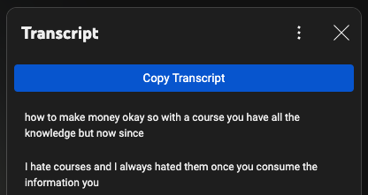

# YouTube Transcript Copier

A Chrome extension that adds a convenient "Copy Transcript" button to YouTube's transcript panel, allowing you to easily copy video transcripts with or without timestamps.

## Features

- Adds a "Copy Transcript" button to YouTube's transcript panel
- Automatically detects when transcripts are available
- Respects your timestamp visibility preference:
  - With timestamps enabled: Copies format `[0:00] Transcript text`
  - With timestamps disabled: Copies only the transcript text
- Clean, native-looking UI that matches YouTube's design
- Instant clipboard copy with visual feedback

## Installation (Developer Mode)

Since this extension isn't published on the Chrome Web Store, you'll need to install it manually in developer mode:

1. Download or clone this repository to your local machine
2. Open Chrome and navigate to `chrome://extensions/`
3. Enable "Developer mode" in the top-right corner
4. Click "Load unpacked" in the top-left corner
5. Select the directory containing the extension files
6. The extension should now appear in your extensions list and be ready to use

## Usage

1. On any YouTube video, click the "Show transcript" option in the video description or menu
2. Wait for the transcript to load
3. (Optional) Toggle timestamps on/off using YouTube's timestamp toggle button
4. Click the "Copy Transcript" button at the top of the transcript panel
5. The transcript will be copied to your clipboard in your chosen format (with or without timestamps)

## Files Included

- `manifest.json` - Extension configuration
- `content.js` - Main script that handles transcript copying
- `background.js` - Background script for handling transcript API requests
- `styles.css` - Styling for the copy button

## Development

To modify the extension:

1. Make your changes to the source files
2. Go to `chrome://extensions/`
3. Click the refresh icon on the extension card
4. Reload any YouTube pages to see your changes

## Notes

- This extension requires the "clipboardWrite" and "webRequest" permissions to function
- Tested on Chrome/Chromium-based browsers
- May need updates if YouTube changes their transcript panel structure
- For personal/development use only

## Contributing

Feel free to submit issues or pull requests if you find bugs or have suggestions for improvements.
