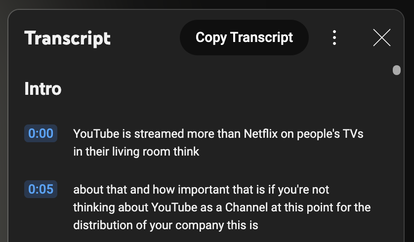

# YouTube Transcript Copier

A simple Tampermonkey userscript that adds a "Copy Transcript" button to YouTube's transcript panel.

## Installation

1. Install Tampermonkey for your browser:

   - [Chrome Web Store](https://chrome.google.com/webstore/detail/tampermonkey/dhdgffkkebhmkfjojejmpbldmpobfkfo)
   - [Firefox Add-ons](https://addons.mozilla.org/en-US/firefox/addon/tampermonkey/)
   - [Edge Add-ons](https://microsoftedge.microsoft.com/addons/detail/tampermonkey/iikmkjmpaadaobahmlepeloendndfphd)

2. Install the script:
   - Open Tampermonkey dashboard
   - Create a new script (+ tab)
   - Copy and paste the entire ![youtubeTranscriptCopier.js] script
   - Save (Ctrl+S or File → Save)

## Usage

1. On any YouTube video, click the "Show transcript" option
2. Wait for the transcript to load
3. Click the "Copy Transcript" button that appears at the top
4. The transcript will be copied to your clipboard with timestamps

That's it! 🎉

(Note: This script was tested on Chrome and there may be breaking issues in the future if YouTube changes the transcript panel)
